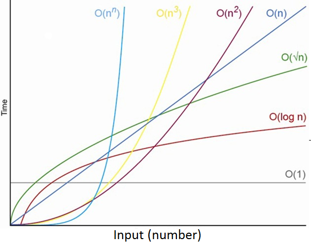

<p align="center">

</p>

## Análise de Algoritmos Básicos de Ordenação

### Faça a análise de complexidade dos algoritmos de ordenação abaixo, respondendo às seguintes perguntas:

-   Quantas comparações o algoritmo faz no melhor caso? E no pior caso?

### bubble_sort:
```
Melhor caso: (n-1) * (n-1)
Pior caso: (n-1) * (n-1)

Exemplo: 
n == 4
3*3 == 9 comparações.
```

  As comparações tanto no **melhor** caso quanto no **pior** serão sempre iguais a quantidade de iterações do laço **for** interno multiplicado pelo laço **for** externo.

---

### selection_sort:
```
Melhor caso: (n * (n-1))/2
Pior caso: (n * (n-1))/2

Exemplo:
n == 4
(4 * (4-1))/2 == 6 comparações.
```
Assim como no **bubble sort** tanto as comparações no **melhor** quanto no **pior** caso são semelhantes, já que não importa se o vetor está ordenado, a mesma quantidade de iterações serão realizadas.

A quantidade de comparações aqui pode ser extraída por meio da formula **(n * (n-1))/2**. Isso me permite calcular as comparações mais facilmente já que a cada iteração do loop externo o loop interno diminui suas iterações de forma proporcional

    Exemplo:
    n == 4
    for externo -> 4 iterações.
    for interno -> 4, 3, 2, 1, 0 iterações.

    Isso quer dizer que a cada iteração do for externo o interno diminui uma iteração.

---

### insertionSort:
```
Melhor caso: Vetor já ordenado [1, 2, 3] -> n-1 comparações.

Dentro do loop interno, o elemento atual está sendo comparado com os elementos anteriores no array. Isso é feito para determinar a posição correta do elemento na parte ordenada do array. Quando o vetor já está ordenado, em todas as iterações do loop interno, a comparação "atual < original[j]" resultará em "falso". Consequentemente, a comparação será executada apenas uma vez durante o loop interno para cada valor de "i" no loop externo.
```
```
Pior caso: Vetor ordenado em forma decrescente -> n-1 comparações.

A comparação no loop interno sempre será verdadeira até que o elemento atual alcance o início do array. Assim como no melhor caso as comparações do loop interno serão realizadas n-1 vezes.
```
---
---
---
-   Quantas trocas o algoritmo faz no melhor caso? E no pior caso?

### bubble_sort:

    Melhor caso -> 0 trocas.

    Se o array estiver previamente ordenado, como no caso de [1, 2, 3], não ocorrerá nenhuma troca, uma vez que a comparação ocorre entre elementos consecutivos para verificar se um elemento é maior do que o próximo.

    Pior caso -> (n * (n - 1)) / 2 -> trocas.

    Caso o vetor esteja em ordem decrescente [3, 2, 1] será realizado a quantidade de trocas igual à (n * (n - 1)) / 2
      Exemplo:
        n == 3
        (3 * (3 - 1)) / 2
        6 / 2 == 3 trocas.

        k == 1
        3 2 1 -> vetor inicial.
        2 3 1 -> j == 0 -> 1ª troca.
        2 1 3 -> j == 1 -> 2ª troca.

        k == 2
        2 1 3 -> vetor inicial.
        1 2 3 -> j == 0 -> 3ª troca -> vetor ordenado.
---

### selection_sort:
  ```
  Melhor caso -> 0 trocas.

  Caso o vetor já esteja ordenado, por exemplo: [1, 2, 3] não é realizada nenhuma troca, já que a comparação feita é se um elemento é menor que o seu elemento anterior.

  Pior caso:

  Caso o vetor esteja em uma ordem aleatória ([3, 1, 2]) será realizado 2 trocas.

  Exemplo:
  n == 3

  i == 0
  3 1 2 -> vetor inicial.
  1 3 2 -> j == 2 -> 1ª troca.

  i == 1
  1 3 2 -> vetor inicial.
  1 2 3 -> j == 3 -> 2ª troca.
  ```
---
### insertionSort:
```
Melhor caso: (n - 1) trocas.
Como nesse caso o vetor está ordenado e somente a troca dentro do loop externo será realizada, as trocas sempre serão iguais à (n - 1) iterações.
```

```
Pior caso:
Em um vetor [4, 3, 2, 1] são realizadas 9 trocas(6 loop interno, 3 loop externo), enquanto que em um vetor [3,2,1] são feitas 5 trocas(3 loop interno, 2 loop externo). As trocas dependem do tamanho do vetor e não seguem um padrão fixo, então não encontrei uma formula para expressar a quantidade de trocas.
```
---
---
---
-   Qual a complexidade do algoritmo no melhor caso? E no pior caso?

### bubble_sort:
  ```
  Melhor caso -> O(n^2)
  Pior caso -> O(n^2)

  Como não existe nenhum mecanismo para identificar quando o vetor já está ordenado, tanto para o pior dos casos(vetor em ordem descrescente) quanto para o melhor(vetor já ordenado), serão realizadas (n-1) * (n-1) comparações(operação fundamental). 
  
  Dessa forma a complexidade é igual nos dois casos, sendo:
  (n-1)^2 ou O(n^2).

  Exemplo:
  n == 3
  O(3^2) == 9 comparações.
  
  Já que o k e o j não vão comparar o último elemento do vetor com o próximo(inexistente) a complexidade ainda se mantém O(n^2), porém ficando da seguinte forma:
  (3-1)^2 == 4 comparações ou O(2^2) == 4 comparações.

  ```
---
### selection_sort:
  ```
  Melhor caso: O(n^2)
  Pior caso: O(n^2)

  Já que nesse algoritmo assim como no bubble sort não existe nenhum mecanismo para identificar se o vetor está ordenado, será realizada a mesma quantidade de comparações tanto no melhor quanto no pior caso.

  Exemplo:
  [1, 2, 3] -> melhor
  [3, 1, 2] -> pior
  (n * (n-1))/2 -> 3 comparações.

  Em ambos os casos serão realizadas 3 comparações, independentemente do vetor estar ordenado ou não.
  ```
---
### insertionSort:
```    
Melhor caso: O(n)

Quando analisamos a complexidade no melhor caso e encontramos que são feitas "n - 1" comparações, isso resulta em uma complexidade de O(n). Não é preciso especificar "O(n - 1)" na notação, porque a notação O(n) já abrange o comportamento assintótico de crescimento linear em relação ao tamanho do input.
```
```
Pior caso: O(n)
Mesmo no pior caso, o número de comparações ainda crescerá linearmente com o tamanho da entrada, resultando em uma complexidade de O(n).
```
---
---
---
### Algoritmos: 

#### Bubble Sort :

```c
void bubble_sort (int vetor[], int n) {
    int k, j, aux;

    for (k = 1; k < n; k++) {

        for (j = 0; j < n - 1; j++) {

            if (vetor[j] > vetor[j + 1]) {
                aux = vetor[j];
                vetor[j] = vetor[j + 1];
                vetor[j + 1] = aux;
            }
        }
    }
}
```

#### Selection Sort:
```c
void selection_sort(int num[], int tam) {
  int i, j, min, aux;
  for (i = 0; i < (tam-1); i++)
  {
     min = i;
     for (j = (i+1); j < tam; j++) {
       if(num[j] < num[min])
         min = j;
     }
     if (num[i] != num[min]) {
       aux = num[i];
       num[i] = num[min];
       num[min] = aux;
     }
  }
}
```

#### Insertion Sort:
```c
void insertionSort(int* original, int length) {
	int i, j, atual;

	for (i = 1; i < length; i++) {
		atual = original[i];

		for (j = i - 1; (j >= 0) && (atual < original[j]); j--) {
			original[j + 1] = original[j];
        }

		original[j+1] = atual;
	}
}
```
