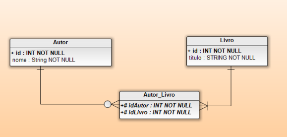
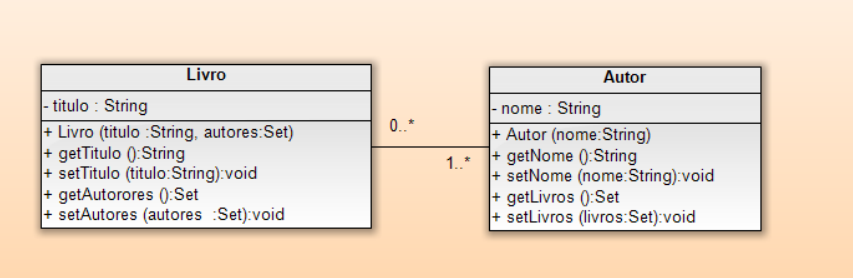

## Aplicação Autor/Livro
Uma biblioteca possui um sistema para gerenciar
seus livros. Os livros e autores são entidades
separadas. Um livro pode ser escrito por diversos
autores e um autor pode escrever diversos livros. A relação no banco de dados é muitos para muitos.

### Estrutura das entidades:


### Diagrama de classes:



### Código mysql>
```sql
CREATE DATABASE BIBLIOTECA;

USE BIBLIOTECA;

CREATE TABLE AUTOR (
	id INT NOT NULL AUTO_INCREMENT,
	nome VARCHAR(255),
	primary key (id)
);

CREATE TABLE LIVRO (
	id INT NOT NULL AUTO_INCREMENT,
	livro VARCHAR(255),
	primary key (id)
);

CREATE TABLE AUTOR_LIVRO (
    id BIGINT NOT NULL AUTO_INCREMENT,
    idAutor INT NOT NULL,
    idLivro INT NOT NULL,
    primary key (id),
    foreign key (IdAutor) references AUTOR(id),
    foreign key (idLivro) references LIVRO(id)
);
```